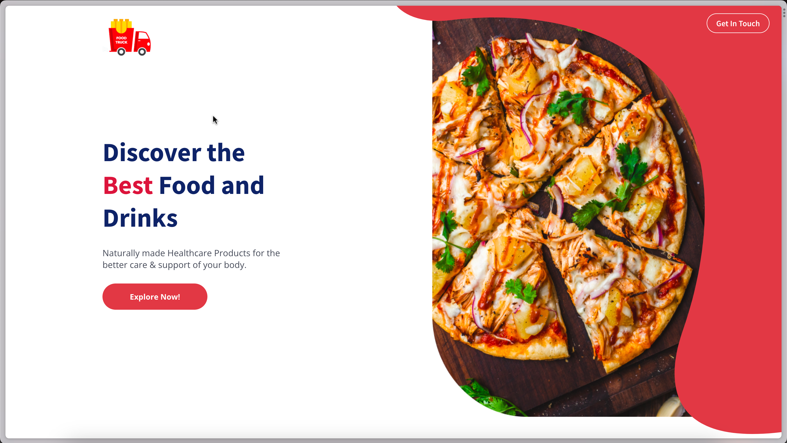

## Food Truck - All About Foods 🥗

Built using **JavaScript**, **React**.

Demo: **https://foodtruckif.vercel.app/**



<!-- GETTING STARTED -->
## Getting Started

Running a development environment for this project will be the easiest thing in you day.

### Steps to run

* Clone the repository

  ```zsh
  git clone https://github.com/sarkartanmay393/Foodtruck-React.git
  ```

* Start react project

  ```zsh
  npm start 
  ```

<br />

> If any issue occurred while running, retry all.

<p align="right">(<a href="#readme-top">back to top</a>)</p>

<!-- CONTRIBUTING -->
## Contributing

Contributions are what make the open source community such an amazing place to learn, inspire, and create. Any contributions you make are **greatly appreciated**.

If you have a suggestion that would make this better, please fork the repo and create a pull request. You can also simply open an issue with the tag "enhancement" or "good-first-issues".
Don't forget to give the project a star! Thanks again!

1. Fork the Project
2. Create your Feature Branch (`git checkout -b feature/AmazingFeature`)
3. Commit your Changes (`git commit -s -m 'Add some AmazingFeature'`)
4. Push to the Branch (`git push origin feature/AmazingFeature`)
5. Open a Pull Request
6. Wait for review

> All of your commits should be signed always.

<!-- ROADMAP -->
## Roadmap

* [x] Styling
* [x] Responsive UI
* [x] Web Application

See the [open issues](https://github.com/sarkartanmay393/Foodtruck-React/issues) for a full list of proposed features (and known issues).

<!-- CONTACT -->
## Contact

Your Name - Tanmay Sarkar [@sarkartanmay393](https://twitter.com/sarkartanmay393) - [hello@tanmaysarkar.tech](mailto:hello@tanmaysarkar.tech)

Project Link: [https://github.com/sarkartanmay393/Foodtruck-React](https://github.com/sarkartanmay393/Foodtruck-React)

**Thanks for visiting my project. If you like it, please give it a star. It will help me a lot. Thanks again!**

<p align="right">(<a href="#readme-top">back to top</a>)</p>